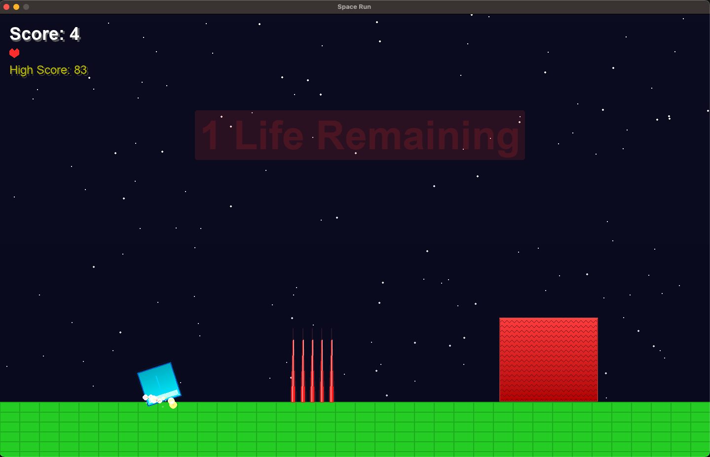

# Space Run



A fast-paced side-scrolling runner game where you navigate through obstacles in space.

## Installation & Startup
1. Make sure you have Python 3 installed
2. Make the start script executable:
   ```bash
   chmod +x start.sh
   ```
3. Run the game:
   ```bash
   ./start.sh
   ```
   This will automatically:
   - Create a Python virtual environment if it doesn't exist
   - Install all required dependencies
   - Launch the game

## How to Play
- Use SPACE to jump
- Collect power-ups to gain advantages
- Avoid obstacles and spikes
- Press F11 to toggle fullscreen
- Press ESC to exit

## Features
- Multiple power-ups with different effects
- Lives system
- High score tracking
- Dynamic visual effects

## Controls
- SPACE: Jump
- H: Show power-up guide
- F11: Toggle fullscreen
- ESC: Exit fullscreen/game
- R: Restart game (when game over) 